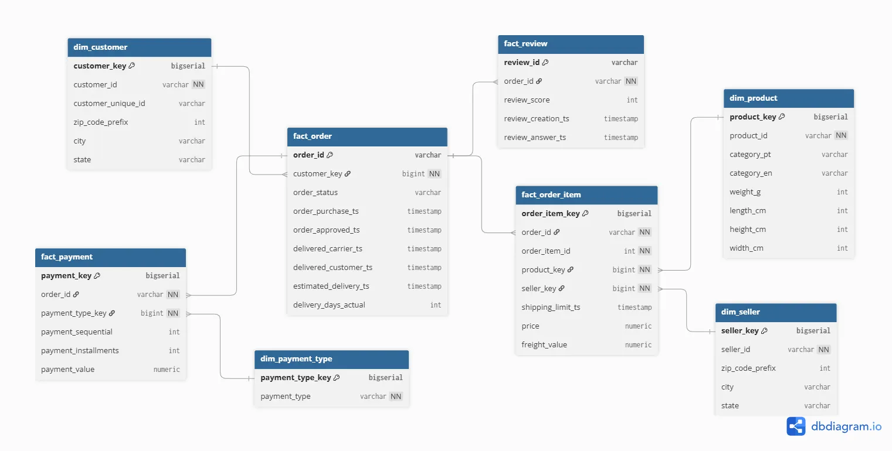

# Databricks Lakehouse Data Engineering Project

## Overview

This project implements a **Data Engineering pipeline using the Databricks Lakehouse platform**. The pipeline ingests raw data from **Cloudflare R2 object storage**, processes it using scalable ingestion mechanisms, and transforms it into structured datasets for analytics.

The project demonstrates modern data engineering practices such as automated ingestion, layered data architecture, SQL-based transformations, and version-controlled development using Databricks Git folders.

The dataset used in this project is the **Olist Brazilian E-Commerce Dataset**.

Dataset Source:
https://www.kaggle.com/datasets/olistbr/brazilian-ecommerce

---

# 1. Data Ingestion

The data ingestion layer is responsible for loading raw files from **Cloudflare R2 object storage** into Databricks.

Two ingestion strategies are implemented in this project:

### Batch Ingestion

Static datasets are ingested using **batch processing**. These datasets change infrequently and are loaded as full datasets during scheduled runs.

### Streaming Ingestion

Transactional datasets are ingested using **Databricks Auto Loader with Structured Streaming**. This allows the pipeline to automatically detect and process new files as they arrive in cloud storage.

Streaming ingestion enables:

* Incremental file processing
* Automatic schema detection
* Scalable data ingestion

Ingestion jobs are **scheduled using Databricks workflows** to ensure the pipeline runs automatically.

All ingested data is stored in **Delta tables in the Bronze layer**.

---

# 2. Schema Design (Data Modeling)

After ingestion, a logical schema is designed to define relationships between datasets and support analytical workloads.

The schema modeling stage focuses on identifying key entities and their relationships, such as customers, orders, products, and payments.

This step ensures that the data structure supports efficient querying and analytical use cases.

Schema Diagram:

The schema diagram represents the logical relationships between different entities in the dataset.

---

# 3. SQL Transformations (ETL)

Data transformations are implemented using **SQL-based ETL processes**.

The transformation layer reads data from the Bronze tables and performs operations such as:

* Data type standardization
* Data validation
* Cleaning and normalization
* Joining related datasets
* Preparing structured datasets

These transformations produce **Silver layer tables**, which contain cleaned and standardized data.

Further transformations generate **Gold layer datasets**, which are optimized for analytics and reporting.

Using SQL for transformations ensures that the pipeline remains easy to maintain and aligns with common analytics workflows.

---

# 4. Physical Data Modeling

The final stage of the pipeline focuses on **physical data modeling**, which defines how the data is stored and optimized in the Lakehouse environment.

Physical modeling includes decisions related to:

* Table structure
* Partitioning strategy
* Storage format
* Query performance optimization

All tables are stored using **Delta Lake format**, which provides reliability, scalability, and performance improvements.

This stage ensures that the datasets are optimized for analytical queries and downstream data consumption.

---

# Version Control

The entire project is maintained using **Databricks Git folder integration**, enabling version control for notebooks, scripts, and documentation.

Version control provides:

* Change tracking
* Collaborative development
* Structured project management

---

# Conclusion

This project demonstrates how a scalable data pipeline can be built using Databricks by combining automated ingestion, structured data modeling, SQL-based transformations, and optimized storage design. The implementation follows industry best practices for building reliable and maintainable data engineering systems.
